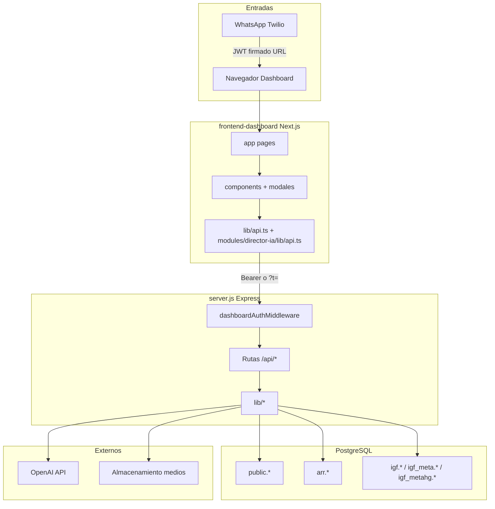

# ARQUITECTURA_DASHBOARD_FOLIOS.md

**Documento de auditoría técnica (solo lectura del código existente)**  
**Repositorio:** `folio-whatsapp-bot`  
**Fecha de elaboración:** 2026-08-04  
**Alcance:** Dashboard de Folios (Next.js `frontend-dashboard`) + API Express (`server.js` + `lib/*`) + esquemas SQL en el repo.

### Cómo leer este documento

- Contiene **únicamente información existente** en el código y en `sql/`.
- Donde no hay DDL / vistas / funciones / hooks / providers en el repositorio, se indica explícitamente: *«No encontradas en el repositorio»*.
- No propone cambios ni roadmaps.
- La sección **§7 IA** de cada módulo indica el estado de uso por **Director IA** tal como está cableado hoy.

### Fuentes consultadas

| Capa | Ubicación |
|------|-----------|
| Frontend | `frontend-dashboard/app/*`, `components/*`, `modules/director-ia/*`, `lib/api.ts`, `lib/auth.ts` |
| Backend | `server.js`, `lib/*`, `igf-handler.js`, `notifications/*` |
| SQL | `sql/*.sql` + `CREATE TABLE` / `ALTER TABLE` embebidos en `server.js` y algunos `lib/*` |

---

## Mapa del sistema



---

## Auth y permisos transversales

### Información

| Campo | Valor |
|-------|--------|
| Nombre | Autenticación dashboard + catálogo de permisos |
| Rutas | `lib/dashboard-auth.js`, `lib/usuario-permisos.js`, guards en `server.js` |
| Propósito | Validar JWT de dashboard/WhatsApp; aplicar permisos por rol y overrides en token |

### Frontend

- `frontend-dashboard/lib/auth.ts`: `parseTokenFromQuery`, `getTokenFromStorage`, `setTokenInStorage`, `clearToken`, `decodeDashboardTokenPayload`, `getRoleFromDashboardToken`, `getPermisosFromDashboardToken`, `tokenHasPermiso`, `normalizeDashboardToken`.
- **Hooks / Context / Providers dedicados:** No encontrados en el repositorio.

### Backend

- **Middleware:** `dashboardAuthMiddleware` (`lib/dashboard-auth.js`): token desde `Authorization: Bearer` o query `t=`; normaliza `~` / `%2E` → `.`; verifica con `DASHBOARD_JWT_SECRET` / `JWT_SECRET`; asigna `req.dashboardAuth`.
- **Helpers in-handler en `server.js`:** `dashboardBlockGVForbidden`, `dashboardBlockGVFoliosMiddleware`, `dashboardBlockGAFinancialKpis`, `dashboardBlockDicfAccionesRole`, `assertUsuariosAdminClave`, `assertPlantaPermitidaDashboard`, etc.
- **Permisos (`lib/usuario-permisos.js`):** claves incluyendo `acceso_crear_folios`, `acceso_aprobar_folios`, `acceso_aprobar_comprobaciones`, `acceso_mover_folio_arrastre`, `acceso_avanzar_etapa`, `acceso_solicitar_cancelacion`, `acceso_aprobar_cancelacion`, `acceso_cancelar_folio_dashboard`, `acceso_editar_folio`, `acceso_subir_poliza`, `acceso_marcar_solo_zp_ad`, `acceso_ver_folios_solo_zp_ad`, `acceso_asignar_mes_cargo`, `acceso_marcar_urgente`, `acceso_ver_imprimir_folios`, `acceso_igf_forecast_kpis`, `acceso_acciones_dicf`, `acceso_consola_whatsapp_ar`.
- Función de chequeo: `usuarioPermisos.authHasPermiso(auth, clave)`.

### Base de datos

- `public.usuarios` (incluye `permisos_json` vía ALTER en bootstrap).
- `public.roles`.
- Vistas / funciones / procedimientos: No encontradas en el repositorio para este dominio.

### Flujo

```
Usuario (WhatsApp o login URL)
  ↓
createDashboardToken / JWT
  ↓
Navegador (?t= o storage)
  ↓
apiFetch + Authorization Bearer
  ↓
dashboardAuthMiddleware
  ↓
authHasPermiso / bloqueos GV|GA
  ↓
Handler de ruta
```

### Dependencias

- **Usado por:** prácticamente todas las rutas `/api/dashboard/*`, `/api/folios*`, `/api/action-register/*`, `/api/director-ia/*`, `/api/usuarios-admin*`, `/api/arr/*`.
- **Consume:** secretos de entorno, tabla usuarios/roles.

### IA — Director IA

- [x] Lo usa parcialmente  
- **Cómo:** mismos JWT y `assertDashboardPlantaAccessForActionRegister` en handlers Director IA.  
- **Archivos:** `lib/dashboard-auth.js`, `lib/usuario-permisos.js`, handlers en `lib/director-ia-*.js` / `server.js`.  
- **Endpoints:** todos `/api/director-ia/*` pasan `dashboardAuthMiddleware`.

### Riesgos observados

- Duplicidad de entrada de token (`Bearer` vs `?t=`).
- Permiso `acceso_consola_whatsapp_ar` catalogado; enforcement en handler WhatsApp no verificado como gate universal en este inventario.

---

# MÓDULOS

---

## M1. Health

### 1. Información general

| Campo | Valor |
|-------|--------|
| Nombre | Health |
| Ruta FE | `frontend-dashboard/app/health/route.ts` → `/health` |
| Ruta BE | `GET /health`, `GET /health-db`, `GET /health-proyectos` |
| Descripción | Comprobación de servicio y DB |
| Propósito | Monitoreo / readiness |

### 2. Frontend

- Página: `app/health/route.ts` → JSON `{ ok: true, service: "folio-dashboard" }`.
- Componentes / modales / hooks / context / providers: No aplican.

### 3. Backend

| Método | Path | Auth |
|--------|------|------|
| GET | `/health` | No |
| GET | `/health-db` | No |
| GET | `/health-proyectos` | No |
| GET | `/debug/actor` | Solo si `DEBUG` |

### 4. Base de datos

- `/health-db` consulta conectividad al pool.
- Tablas propias: ninguna.

### 5. Flujo

```
Monitor → GET /health|/health-db → server.js → (pool) → JSON
```

### 6. Dependencias

- Independiente. Consumido por infraestructura externa (no referenciado por Director IA).

### 7. IA — Director IA

- [x] No lo usa

### 8. Riesgos

- Ninguno material respecto al producto.

---

## M2. Kanban / Folios

### 1. Información general

| Campo | Valor |
|-------|--------|
| Nombre | Kanban de folios |
| Ruta | FE: `/dashboard` → `app/dashboard/page.tsx`; BE: `/api/dashboard/kanban`, `/api/folios*` |
| Descripción | Tablero por etapas visuales; CRUD operativo de folios |
| Propósito | Flujo de aprobación, pago, comprobación y evidencias |

### 2. Frontend

**Páginas:** `app/dashboard/page.tsx`

**Componentes:** `KanbanBoard.tsx`, `EtapaColumn.tsx`, `FolioCard.tsx`, `FolioDrawer.tsx`, `FiltersBar.tsx`, `PlantaSection.tsx`, `PlantTable.tsx`, `KPIHeader.tsx`, `ResumenCategoriasMesCargo.tsx`

**Modales:** `CrearFolioModal`, `CrearProyectoModal`, `EditarFolioModal`, `PolizaModal`, `ImprimirGastosModal`, `AnalisisDuplicadosModal`, `TallerAtExportModal`, `CategoriaRangoExportModal`, `ClasificacionApoyosModal`, `ClasificacionCompararModal`, deltas (`DeltaVentaModal`, `DeltaDescuentoModal`, `DeltaIngresoModal`, …), `ComoCambioModal`

**Hooks / Context / Providers:** No encontrados (solo hooks React locales).

### 3. Backend

**Kanban / listados**

| Método | Path | Middleware |
|--------|------|------------|
| GET | `/api/dashboard/kanban` | `dashboardAuthMiddleware` + bloqueo GV |
| GET | `/api/dashboard/plantas` | `dashboardAuthMiddleware` |
| GET | `/api/dashboard/kpis` | `dashboardAuthMiddleware` + GA/GV |

**Folios** (todos: `dashboardAuthMiddleware` + `dashboardBlockGVFoliosMiddleware`):  
`POST /api/folios`, `GET /api/folios/:id`, `PATCH /api/folios/:id`, `PATCH .../editar`, `PATCH .../prioridad`, `PATCH .../mes` vía body, `PATCH .../solo-zp-ad`, `PATCH .../rechazo-cdjz`, `PATCH .../prestamo-*`, `PATCH .../por-recuperar`, `PATCH .../numero-cheque`, `POST .../aprobar`, `POST .../aprobar-comprobaciones`, `POST .../avanzar-etapa`, `POST .../mover-etapa`, `POST .../regresar-zp`, `POST .../cancelar`, `POST .../poliza`, `POST .../cotizacion`, `POST .../factura`, `POST .../solicitar-por-recuperar`, `POST .../comentarios`, `GET .../comentarios`, `GET .../timeline`, `GET .../media`, `GET .../media/:mediaId/url`, `DELETE .../media/:mediaId`, `GET .../finanzas`, documentos PDF/HTML (ver M15).

**Permisos relevantes:** `acceso_crear_folios`, `acceso_aprobar_folios`, `acceso_editar_folio`, `acceso_mover_folio_arrastre`, `acceso_avanzar_etapa`, `acceso_subir_poliza`, `acceso_ver_folios_solo_zp_ad`, `acceso_marcar_solo_zp_ad`, `acceso_cancelar_folio_dashboard`, etc.

**Etapas visuales (constantes en `server.js`):**  
`PENDIENTE_APROB_PLANTA`, `APROB_DIRECTOR_ZP`, `CARRO_COMPRA`, `CUENTA_FONDOS`, `CHEQUE_GENERADO`, `DEPOSITO_CIERRE`, `COMPROBACIONES`, `EVIDENCIAS`, `CANCELADO`.  
Mapeo técnico: p. ej. Depósito y cierre ← `PAGADO`/`CERRADO`; Carro ← `APROBADO_ZP` y afines.

### 4. Base de datos

| Tabla | Uso |
|-------|-----|
| `public.folios` | Entidad principal |
| `public.folio_historial` | Timeline / eventos |
| `public.folio_archivos` | Medios |
| `public.comentarios` | Comentarios de folio |
| `public.folio_counters` | Numeración |
| `public.plantas` | Planta |
| `public.proyectos` | Opcional vínculo proyecto |

Vistas / funciones / procedimientos almacenados: No encontradas en el repositorio.

### 5. Flujo

```
Usuario /dashboard
  ↓
fetchKanban(token, filtros)
  ↓
GET /api/dashboard/kanban
  ↓
buildDashboardWhere + query folios
  ↓
estatusToEtapaVisual → columnas
  ↓
KanbanBoard / FolioCard
  ↓
FolioDrawer → acciones PATCH/POST /api/folios/:id/*
  ↓
UPDATE public.folios (+ historial)
  ↓
Respuesta JSON → refresh kanban
```

### 6. Dependencias

- **Consume:** plantas, permisos, presupuestos (mes cargo / carro), proyectos.
- **Consumido por:** Clasificación (lee folios), Taller/GASTOS Excel, IGF folios detalle, comentarios en Director IA (`public.comentarios` ⋈ folios), WhatsApp notificaciones.

### 7. IA — Director IA

- [x] Lo usa parcialmente  
- **Cómo:** comentarios de folio en contexto/chat (`cliente-comentarios` / folio comentarios vía `director-ia-context` / chat). No opera el kanban ni aprueba folios.  
- **Archivos:** `lib/director-ia-context.js`, `lib/director-ia-chat.js`, `lib/cliente-comentarios.js`  
- **Endpoint:** `GET /api/director-ia/context`, `POST /api/director-ia/chat`  
- **Funciones:** carga de comentarios en payload de contexto / anexos de chat.

### 8. Riesgos

- `server.js` monolítico concentra casi toda la lógica de folios.
- Duplicidad de normalización de unidad (WhatsApp vs `lib/unidad-taller.js` unificado parcialmente).
- GV bloqueado del módulo folios por middleware dedicado.

---

## M3. Plantas / KPIs / Proyectos

### 1. Información general

| Campo | Valor |
|-------|--------|
| Nombre | Plantas, KPIs y Proyectos |
| Ruta | `/api/dashboard/plantas`, `/kpis`, `/proyectos`; UI en dashboard e inicio |
| Propósito | Catálogo de plantas, indicadores, proyectos por planta |

### 2. Frontend

- `fetchPlantas`, `fetchKpis`, `fetchProyectosPorPlanta`, `postCrearProyecto` en `lib/api.ts`.
- `CrearProyectoModal.tsx`, `KPIHeader.tsx`, filtros por planta en `FiltersBar` / páginas.

### 3. Backend

| Método | Path |
|--------|------|
| GET | `/api/dashboard/plantas` |
| GET | `/api/dashboard/kpis` |
| GET | `/api/dashboard/proyectos` |
| POST | `/api/proyectos` |

Auth: `dashboardAuthMiddleware`. KPIs: bloqueos GA/GV según handler.

### 4. Base de datos

- `public.plantas`
- `public.proyectos`, `public.proyecto_counters`, `public.proyecto_archivos`, `public.proyecto_historial`

### 5. Flujo

```
UI selecciona planta
  ↓
GET /api/dashboard/plantas | kpis | proyectos
  ↓
Query plantas / agregados / proyectos
  ↓
JSON → FiltersBar / KPIHeader / modales
```

### 6. Dependencias

- Base para Kanban, ARR, IGF, Action Register, Director IA (filtro `planta_id`).

### 7. IA — Director IA

- [x] Lo usa parcialmente  
- **Cómo:** `planta_id` obligatorio; labels desde `public.plantas`.  
- **Endpoints:** todos `/api/director-ia/*?planta_id=`

### 8. Riesgos

- Equivalencias de planta (ids múltiples por clave E7/E9…) repartidas en varios helpers (`getPlantaIdsEquivalentesForPendientes`, configs en Excel/libs).

---

## M4. Clasificación de apoyos + COMPARAR/ACTUALIZAR

### 1. Información general

| Campo | Valor |
|-------|--------|
| Nombre | Clasificación de apoyos / Comparar Excel |
| Ruta UI | Botones en dashboard (`ClasificacionApoyosModal`, `ClasificacionCompararModal`) |
| Propósito | Comparativo mensual por planta/categoría; importar Excel y reconciliar |

### 2. Frontend

- Modales: `ClasificacionApoyosModal.tsx`, `ClasificacionCompararModal.tsx`
- API: `fetchClasificacionApoyos`, `fetchClasificacionApoyosDetalle`, `downloadClasificacionApoyosExcel`, `postClasificacionComparar*`, etc.

### 3. Backend

| Método | Path |
|--------|------|
| GET | `/api/dashboard/clasificacion-apoyos` |
| GET | `/api/dashboard/clasificacion-apoyos/detalle` |
| GET | `/api/dashboard/clasificacion-apoyos-excel` |
| POST | `/api/dashboard/clasificacion-comparar/inspeccionar` |
| POST | `/api/dashboard/clasificacion-comparar` |
| POST | `/api/dashboard/clasificacion-comparar/agregar` |
| POST | `/api/dashboard/clasificacion-comparar/rechazar` |
| POST | `/api/dashboard/clasificacion-comparar/confirmar-mismo` |
| POST | `/api/dashboard/clasificacion-comparar/son-distintos` |

Middleware: `dashboardAuthMiddleware` + bloqueo GV. Clave privados: query `priv_clave` (`CLASIFICACION_PRIV_CLAVE` / `Tomza-Priv`).

Libs: `lib/clasificacion-apoyos-excel.js`, `lib/clasificacion-comparar.js`.

### 4. Base de datos

- Lectura/escritura sobre `public.folios` (y campos mes_cargo, estatus, etc.).
- No hay tablas propias `clasificacion_*` en el inventario DDL del repo.

### 5. Flujo

```
Usuario elige meses (+ priv_clave opcional)
  ↓
GET clasificacion-apoyos | Excel
  ↓
Query folios por mes_cargo / planta
  ↓
lib clasificacion-apoyos-excel → workbook o JSON matriz
  ↓
COMPARAR: upload Excel → inspeccionar/comparar → agregar|rechazar|confirmar-mismo
  ↓
INSERT/UPDATE folios según acción
```

### 6. Dependencias

- Depende de folios/plantas. Consumido solo por UI dashboard (no por Director IA).

### 7. IA — Director IA

- [x] No lo usa

### 8. Riesgos

- Lógica Excel voluminosa en `clasificacion-apoyos-excel.js`.
- Clave de privados en query string.

---

## M5. Taller por AT

### 1. Información general

| Campo | Valor |
|-------|--------|
| Nombre | Taller por AT |
| Ruta | Modal `TallerAtExportModal`; `GET /api/dashboard/taller-at-excel` |
| Propósito | Excel gasto taller por unidad (AT), por planta, con duplicados |

### 2. Frontend

- `TallerAtExportModal.tsx`
- `downloadTallerAtExcel` en `lib/api.ts`
- Botón en `ResumenCategoriasMesCargo` / dashboard

### 3. Backend

| Método | Path |
|--------|------|
| GET | `/api/dashboard/taller-at-excel` |

Query: `mes_desde`, `mes_hasta`, `planta_id?`, `priv_clave?`.  
Libs: `lib/taller-at-excel.js`, `lib/unidad-taller.js`.

### 4. Base de datos

- `public.folios` (+ join `public.plantas`)
- Homologación de `unidad` (también script `scripts/homologar-unidad-taller.sql` con función PG opcional)

### 5. Flujo

```
Usuario rango meses + priv_clave
  ↓
GET taller-at-excel
  ↓
Query TALLER no cancelados
  ↓
unidadTaller.parse/split + expandTallerRows
  ↓
buildTallerAtWorkbook (Resumen / detalle / Duplicados)
  ↓
xlsx attachment
```

### 6. Dependencias

- Folios, plantas, clave privados. No alimenta Director IA.

### 7. IA — Director IA

- [x] No lo usa  
- (Action Register tema «Taller» / Mejora Continua área Taller son dominios distintos.)

### 8. Riesgos

- Detección de duplicados del Excel es independiente de `/api/folios/duplicados/*`.
- Función SQL de homologación es auxiliar (pgAdmin), no runtime del server Node.

---

## M6. GASTOS / INVERSIONES (rango Excel)

### 1. Información general

| Campo | Valor |
|-------|--------|
| Nombre | Export categoría rango |
| Ruta | `CategoriaRangoExportModal`; `GET /api/dashboard/categoria-rango-excel` |
| Propósito | Excel GASTOS o INVERSIONES por ventana de meses |

### 2. Frontend

- `CategoriaRangoExportModal.tsx`
- `downloadCategoriaRangoExcel`

### 3. Backend

| Método | Path |
|--------|------|
| GET | `/api/dashboard/categoria-rango-excel?categoria=GASTOS\|INVERSIONES` |

Lib: `lib/categoria-rango-excel.js`. Requiere `priv_clave` según implementación actual en `server.js`.

### 4. Base de datos

- `public.folios`

### 5. Flujo

```
UI categoría + meses + priv_clave
  ↓
GET categoria-rango-excel
  ↓
Query por categoría
  ↓
buildCategoriaRangoWorkbook
  ↓
xlsx
```

### 6. Dependencias

- Folios. Sin consumidores IA.

### 7. IA — Director IA

- [x] No lo usa

### 8. Riesgos

- Paridad de reglas con Clasificación / Taller (filtros de categoría/taller) debe mantenerse manualmente.

---

## M7. IGF Forecast

### 1. Información general

| Campo | Valor |
|-------|--------|
| Nombre | IGF Forecast |
| Ruta FE | `/igf-forecast` → `IgfForecastClient.tsx`; también home `/` |
| Propósito | Forecast financiero por planta/empresa, versiones, HG, presupuesto, pronóstico |

### 2. Frontend

- Páginas: `app/igf-forecast/page.tsx`, `app/page.tsx` (KPIs)
- Componentes: `IgfForecastClient.tsx`, `ComoCambioModal.tsx`, `UsuariosAdminModal.tsx` (desde IGF)
- Libs UI: `lib/igf-kpi-ui.ts`, `lib/metahg-canonical.ts`, `lib/pronostico-local-recalc.ts`

### 3. Backend

| Método | Path |
|--------|------|
| GET | `/api/dashboard/igf-forecast` |
| GET | `/api/dashboard/igf-forecast-mini` |
| PATCH | `/api/dashboard/igf-forecast` |
| GET | `/api/dashboard/igf-versiones` |
| GET | `/api/dashboard/igf-empresas` |
| GET | `/api/dashboard/igf-folios-detalle` |
| GET | `/api/dashboard/pronostico-detalle` |
| POST | `/api/dashboard/pronostico-dias` |
| GET | `/api/dashboard/venta-proyeccion-mes` |
| GET | `/api/dashboard/presupuesto-detalle` |
| POST | `/api/dashboard/presupuesto-comparar` |
| POST | `/api/dashboard/igf-como-cambio-token` |
| POST | `/api/dashboard/igf-como-cambio-datos` |
| GET | `/api/dashboard/igf-meta-versions` |
| GET | `/api/dashboard/igf-meta-excel` |
| GET | `/api/dashboard/igf-metahg` |
| GET | `/api/igf/como-cambio-excel` | token corto `verifyIgfComoCambioToken` |

Auth: `dashboardAuthMiddleware`; bloqueos GA/GV en varios handlers. Permiso UI: `acceso_igf_forecast_kpis`.

Libs: `igf-handler.js`, `lib/igf-meta-excel.js`, `lib/igf-metahg.js`, `lib/venta-proyeccion-mes.js`, partes de `dashboard-arr-forecast.js`.

### 4. Base de datos

| Esquema / tabla | Origen DDL en repo |
|-----------------|-------------------|
| `igf.versions` | ALTER en `server.js` (`created_at`); CREATE no en `sql/` inventariado |
| `igf.compromiso_lines` | Usada en código (`director-ia-igf-arr.js`); CREATE no en `sql/` inventariado |
| `igf_meta.versions`, `igf_meta.meta_lines` | `sql/012_igf_meta_global.sql` |
| `igf_metahg.versions`, `igf_metahg.lines` | `sql/013_igf_metahg*.sql` |
| `arr.pronostico_dias_seleccion`, `arr.pronostico_mini_snapshot` | bootstrap `server.js` |

Vistas / funciones: No encontradas en el repositorio.

### 5. Flujo

```
Usuario /igf-forecast
  ↓
fetchIgfForecast / mini / versiones
  ↓
buildIgfForecastPayload (server / igf-handler)
  ↓
Lectura igf.* + ARR + folios KPI
  ↓
Tabla UI / Excel / PATCH HG
```

### 6. Dependencias

- Consume ARR, folios (KPIs depósito/carro), plantas.
- Consumido parcialmente por Director IA chat (anexo financiero).

### 7. IA — Director IA

- [x] Lo usa parcialmente  
- **Cómo:** anexo IGF/ARR en chat cuando el routing lo activa; `sources.igf` en GET context permanece `false`.  
- **Archivo:** `lib/director-ia-igf-arr.js`, `lib/director-ia-chat.js`  
- **Endpoint:** `POST /api/director-ia/chat`  
- **Función:** helpers de carga/forecast en `director-ia-igf-arr.js` invocados desde `askDirectorIa`.

### 8. Riesgos

- DDL de `igf.compromiso_lines` / create de `igf.versions` no está completo en `sql/` del repo (solo ALTER parcial).
- GET context Director IA no expone IGF aunque el chat sí pueda.

---

## M8. ARR / Forecast provincia

### 1. Información general

| Campo | Valor |
|-------|--------|
| Nombre | ARR |
| Ruta FE | `/arr` → `ArrClient.tsx` |
| Propósito | Carga ARR, clientes mes, forecast provincia, Excel dashboard ARR |

### 2. Frontend

- `app/arr/page.tsx`, `app/arr/ArrClient.tsx`
- Modales: `ArrSimularIngresoModal`, `ArrNuevoClientePlanModal`, `ArrDicfCategoriaBucketsModal`
- Libs export cliente: `lib/arr-export-*.ts`, `lib/arr-categoria.ts`

### 3. Backend

| Método | Path |
|--------|------|
| POST | `/api/arr/load` |
| GET | `/api/arr/last-upload-day` |
| GET | `/api/dashboard/arr-clientes-mes` |
| POST | `/api/arr/refresh-provincia` |
| POST | `/api/arr/forecast` |
| POST | `/api/arr/forecast-provincia` |
| GET | `/api/arr/dashboard-excel` |

Libs: `lib/arr-load.js`, `lib/arr-refresh-provincia.js`, `lib/forecast-mensual.js`, `lib/dashboard-arr-forecast.js`, `lib/feriados-mx.js`, `lib/excel-theme.js`.

### 4. Base de datos (`arr.*` — extracto)

`ventas_diarias_cliente`, `descuentos_diarios_cliente`, `descuentos_notas`, `descuentos_factura`, `descuentos_comision_extra`, `cliente_categoria_mes`, `hg_diario`, `forecast_mensual`, `upload_log`, `provincia_plants`, `venta_toneladas_diarias_provincia`, `descuento_por_kilo_diario_provincia`, … (ver Anexo A).

DDL: `sql/arr_forecast_schema.sql` + CREATE en `server.js`.

### 5. Flujo

```
Carga ARR.xlsm → POST /api/arr/load → arr-load → tablas arr.*
  ↓
UI /arr → arr-clientes-mes / forecast-provincia
  ↓
dashboard-arr-forecast → Excel
```

### 6. Dependencias

- Alimenta IGF, DICF, deltas, weekly discount, Director IA (parcial ARR).

### 7. IA — Director IA

- [x] Lo usa parcialmente  
- **Archivo:** `lib/director-ia-igf-arr.js` (require `dashboard-arr-forecast`)  
- **Endpoint:** `POST /api/director-ia/chat`  
- GET context: `sources.arr = false` fijo en `director-ia-context.js`.

### 8. Riesgos

- Cargas destructivas por mes (`arr-load` borra/inserta mes objetivo — documentado en header del lib).
- Superficie ARR amplia vs recorte usado por IA.

---

## M9. Delta Venta / Delta Descuento / Delta Ingreso

### 1. Información general

| Campo | Valor |
|-------|--------|
| Nombre | Deltas comerciales |
| Ruta | Modales desde dashboard/home |
| Propósito | Comparar periodos de venta, descuento e ingreso |

### 2. Frontend

- `DeltaVentaModal.tsx`, `DeltaDescuentoModal.tsx`, `DeltaIngresoModal.tsx`, `DeltaIngresoClienteForecastModal.tsx`
- API: `fetchDelta*Periodos`, `postDelta*Datos`, `postDeltaIngresoForecastDatos`, Excel forecast URL

### 3. Backend

| Método | Path |
|--------|------|
| GET | `/api/dashboard/delta-venta-periodos` |
| POST | `/api/dashboard/delta-venta-datos` |
| GET | `/api/dashboard/delta-descuento-periodos` |
| POST | `/api/dashboard/delta-descuento-datos` |
| GET | `/api/dashboard/delta-ingreso-periodos` |
| POST | `/api/dashboard/delta-ingreso-datos` |
| POST | `/api/dashboard/delta-ingreso-forecast-datos` |
| GET | `/api/dashboard/delta-ingreso-forecast-excel` |

Libs: `lib/delta-ingreso-forecast.js` (+ datos ARR).

### 4. Base de datos

- Lectura principalmente `arr.*` (ventas/descuentos).
- `arr.delta_ingreso_forecast_cliente` (CREATE en bootstrap server).

### 5. Flujo

```
Modal elige periodos
  ↓
POST delta-*-datos
  ↓
Agregación ARR
  ↓
JSON → tablas UI / Excel
```

### 6. Dependencias

- ARR. DICF usa lógica de ingreso cliente forecast relacionada. Director IA no consume estos endpoints.

### 7. IA — Director IA

- [x] No lo usa  
- (Estado comercial del chat usa `lib/dicf.js` / `director-ia-commercial-state.js`, no los endpoints `delta-*`.)

### 8. Riesgos

- Varias rutas «delta» paralelas (venta / descuento / ingreso / forecast) con superficies solapadas conceptualmente.

---

## M10. Weekly discount LD

### 1. Información general

| Campo | Valor |
|-------|--------|
| Nombre | Lectura semanal descuento (LD) |
| Ruta | `POST /api/dashboard/weekly-discount-lectura`; scheduler WhatsApp |
| Propósito | Narrativa/métricas de descuento semanal |

### 2. Frontend

- Invocado vía API desde flujos dashboard (función `postWeeklyDiscountLectura`).

### 3. Backend

| Método | Path |
|--------|------|
| POST | `/api/dashboard/weekly-discount-lectura` |

Libs: `lib/weekly-discount-narrative.js`, `lib/weekly-discount-ld-config.js`, `lib/weekly-discount-ld-scheduler.js`.

### 4. Base de datos

- ARR descuentos / ventas (lectura).

### 5. Flujo

```
Request o cron lunes CDMX
  ↓
weekly-discount-* 
  ↓
ARR metrics → narrativa
  ↓
WhatsApp / JSON
```

### 6. Dependencias

- ARR, Twilio.

### 7. IA — Director IA

- [x] No lo usa

### 8. Riesgos

- Scheduler acoplado a proceso Node del bot.

---

## M11. DICF + Acciones DICF + Comentarios cliente

### 1. Información general

| Campo | Valor |
|-------|--------|
| Nombre | DICF (Delta Ingreso Cliente Forecast) y acciones |
| Ruta FE | `/` (paneles), `/dicf-accion` |
| Propósito | Oportunidades/proyección por cliente; compromisos y evidencias |

### 2. Frontend

- `DicfAccionesClientePanel.tsx`, `DicfAccionResponderPanel.tsx`, `ClienteComentariosPanel.tsx`
- `app/dicf-accion/page.tsx`
- API amplia `postDicfDatos`, `fetchDicfAcciones*`, attachments, `fetchClienteComentarios`, etc.

### 3. Backend

Rutas bajo `/api/dashboard/dicf-*`, `/api/dashboard/cliente-comentarios`, `/api/dicf-acciones/:id/attachments`, `/api/dicf-attachments/:id`.  
Guard: `dashboardBlockDicfAccionesRole`.  
Libs: `lib/dicf.js`, `lib/dicf-acciones.js`, `lib/cliente-comentarios.js`.

### 4. Base de datos

| Tabla | Origen |
|-------|--------|
| `arr.dicf_config` | server bootstrap |
| `arr.dicf_cliente_mes` | server bootstrap |
| `arr.dicf_acciones` | CREATE en `lib/dicf-acciones.js` |
| `arr.dicf_accion_historial` | CREATE en `lib/dicf-acciones.js` |
| `arr.dicf_acciones_attachments` | server bootstrap |
| `arr.cliente_comentarios` | CREATE en `lib/cliente-comentarios.js` |

### 5. Flujo

```
Home / dicf-accion
  ↓
POST dicf-datos | CRUD dicf-acciones
  ↓
dicf.computeDicf / dicf-acciones
  ↓
arr.dicf_* 
  ↓
WhatsApp notif + URLs firmadas
```

### 6. Dependencias

- ARR, plantas, usuarios asignables.
- **Consumido por Director IA** (contexto DICF + commercial state).

### 7. IA — Director IA

- [x] Lo usa parcialmente  
- **Cómo:** `summarizeDicfContext` / listas commercial_state; límites de filas en chat.  
- **Archivos:** `lib/director-ia-context.js`, `lib/director-ia-action-register.js`, `lib/director-ia-commercial-state.js`, `lib/director-ia-chat.js`  
- **Endpoints:** `GET /api/director-ia/context`, `POST /api/director-ia/chat`  
- GET context: `sources.dicf` true si hay filas; `sources.commercial_state` permanece `false` (cálculo on-demand en chat).

### 8. Riesgos

- CREATE de `dicf_acciones` fuera de carpeta `sql/`.
- Rol GA excluido de KPIs financieros pero parcialmente presente en Acciones según permisos.

---

## M12. Action Register

### 1. Información general

| Campo | Valor |
|-------|--------|
| Nombre | Action Register (Acciones) |
| Ruta | `/acciones` → `app/acciones/page.tsx` |
| Propósito | Tablero de temas/ítems/revisiones/notas/evidencias por planta |

### 2. Frontend

- Página: `app/acciones/page.tsx`
- Botones: Export Excel/PDF, **Chat Director IA**, **Director IA**
- API: `fetchActionRegisterBoard`, revisions, items, entries, attachments, notes, exports

### 3. Backend

Prefijo `/api/action-register/*` (board, revisions, notes, items, entries, attachments, export, export-evidencias, export-day-pdf, responsables, temas).  
Lib principal: `lib/action-register-board.js`, `lib/action-register-temas.js`, `lib/action-register-evidencias-export.js`, `lib/excel-image-compress.js`.

### 4. Base de datos

`arr.action_register_revisions`, `arr.action_register_items`, `arr.action_register_entries`, `arr.action_register_attachments`, `arr.action_register_revision_notes`, `arr.action_register_revision_note_attachments`.

### 5. Flujo

```
/acciones?t=JWT&planta
  ↓
GET board / revisions
  ↓
buildActionRegisterBoardPayload
  ↓
CRUD items/notes/attachments
  ↓
Export evidencias Excel/PDF
```

### 6. Dependencias

- Plantas, usuarios responsables, DICF inyectado en board.
- **Fuente primaria de Director IA** (narrativa AR + Mejora Continua).

### 7. IA — Director IA

- [x] Lo usa parcialmente (casi completo para AR/MC)  
- **Archivos:** `lib/director-ia-action-register.js`, `lib/director-ia-mejora-continua.js`, `lib/director-ia-context.js`, `lib/director-ia-chat.js`  
- **Endpoints:** `GET /api/director-ia/context`, `GET /api/director-ia/mejora-continua`, `POST /api/director-ia/chat`  
- **Función clave:** `buildActionRegisterBoardPayload` reutilizada.

### 8. Riesgos

- Acoplamiento fuerte Director IA ↔ Action Register board.
- Export de evidencias pesado (imágenes).

---

## M13. Director IA

### 1. Información general

| Campo | Valor |
|-------|--------|
| Nombre | Director IA |
| Ruta FE | `/director-ia`; modal chat desde `/acciones` |
| Propósito | Gestión bitácora/entidades/MC + chat ejecutivo LLM |

### 2. Frontend

**Página:** `app/director-ia/page.tsx`  
**Módulo:** `modules/director-ia/`

| Componente | Rol |
|------------|-----|
| `DirectorIaShell.tsx` | Shell planta + paneles |
| `DirectorIaBitacoraPanel.tsx` | Bitácora |
| `DirectorIaComercialEntidadPanel.tsx` | Entidades/alias |
| `DirectorIaMejoraContinuaPanel.tsx` | MC |
| `DirectorIaChatPanel.tsx` | Chat |
| `DirectorIaChatModal.tsx` | Modal desde Acciones |
| `DirectorIaDisabled.tsx` | Flag off |
| `lib/api.ts` | Cliente `/api/director-ia/*` |
| `lib/is-enabled.ts` | `ENABLE_DIRECTOR_IA` (build Next) |

Hooks/context/providers propios: No encontrados.

### 3. Backend

| Método | Path | Handler lib |
|--------|------|-------------|
| GET | `/api/director-ia/context` | `director-ia-context` |
| GET | `/api/director-ia/mejora-continua` | `director-ia-mejora-continua` |
| GET/POST/DELETE | `/api/director-ia/bitacora*` | `director-ia-bitacora` |
| CRUD | `/api/director-ia/comercial-entidades*` / alias | `comercial-entidad` |
| POST | `/api/director-ia/chat` | `director-ia-chat` → `askDirectorIa` |

Flags: `ENABLE_DIRECTOR_IA`, `AI_ENABLED`, `OPENAI_API_KEY`, `DIRECTOR_IA_DEBUG`.  
Modelo chat: `gpt-4o-mini` vía OpenAI HTTP.

### 4. Base de datos

| Tabla | Uso |
|-------|-----|
| `arr.director_ia_bitacora` | `sql/014_*.sql` + runtime |
| `arr.comercial_entidad` / `arr.comercial_entidad_alias` | `sql/016_*.sql` |
| Lectura | `arr.action_register_*`, `arr.dicf_acciones`, `public.plantas`, `public.usuarios`, `igf.versions`, `igf.compromiso_lines`, comentarios |

**No hay tabla de historial de chat.**

### 5. Flujo (chat)

```
Usuario pregunta
  ↓
POST /api/director-ia/chat
  ↓
askDirectorIa (director-ia-chat.js)
  ↓
routing regex → buildDirectorIaContextPayload / MC / IGF-ARR / commercial_state
  ↓
openaiDirectorIaChat
  ↓
{ answer, sources, context_meta }
```

### 6. Dependencias

- Consume: Action Register, DICF, bitácora, entidades, comentarios, IGF/ARR (chat).
- Consumido por: UI Acciones, WhatsApp comando `DirectorIA`.

### 7. IA — Director IA

- [x] Lo usa completamente (este módulo *es* Director IA)  
- Endpoints y funciones listados arriba.

### 8. Riesgos

- Flag FE (build) vs BE (runtime) pueden diverger.
- `sources.igf` / `arr` / `commercial_state` en GET context siempre false.
- Routing por regex; sin persistencia de conversación.
- Cada pregunta puede reconstruir contexto costoso.

---

## M14. Usuarios admin

### 1. Información general

| Campo | Valor |
|-------|--------|
| Nombre | Administración de usuarios |
| Ruta | `UsuariosAdminModal` (desde IGF UI) |
| Propósito | CRUD usuarios/permisos; Excel; unlock con clave |

### 2. Frontend

- `UsuariosAdminModal.tsx`
- API: `unlockUsuariosAdmin`, `fetchUsuariosAdmin*`, `create/patch/delete`, Excel

### 3. Backend

| Método | Path |
|--------|------|
| POST | `/api/usuarios-admin/unlock` |
| GET | `/api/usuarios-admin/meta` |
| GET | `/api/usuarios-admin` |
| GET | `/api/usuarios-admin/excel` |
| POST | `/api/usuarios-admin` |
| PATCH | `/api/usuarios-admin/:id` |
| DELETE | `/api/usuarios-admin/:id` |

Clave: `USUARIOS_ADMIN_CLAVE` (= `Tomza-Priv` en código).  
Lib: `lib/usuario-permisos.js`.

### 4. Base de datos

- `public.usuarios`, `public.roles`, `public.plantas` (asignaciones)

### 5. Flujo

```
UI pide clave → unlock
  ↓
CRUD /api/usuarios-admin*
  ↓
permisos_json / rol / plantas
```

### 6. Dependencias

- Afecta JWT futuros y permisos de todos los módulos.

### 7. IA — Director IA

- [x] No lo usa (excepto lectura incidental `public.usuarios` en bitácora/AR)

### 8. Riesgos

- Misma clave textual compartida con clasificación privados / admin.

---

## M15. Documentos PDF / medios de folio

### 1. Información general

| Campo | Valor |
|-------|--------|
| Nombre | Documentos y media de folio |
| Ruta | Endpoints bajo `/api/folios/:id/...` + `ImprimirGastosModal` |
| Propósito | Cotización, facturas, gastos, póliza, paquete completo, adjuntos |

### 2. Frontend

- `ImprimirGastosModal.tsx`, acciones en `FolioDrawer`
- `fetchDocumentoGastosHtml/Pdf`, `fetchCotizacionPdf`, `fetchFacturasPdf`, `fetchDocumentoFolioPdf`, `fetchDocumentoPolizaPdf`, `fetchDocumentoCompletoPdf`, media helpers

### 3. Backend

GET/POST documentales y media listados en M2. Almacenamiento vía claves S3 / URLs firmadas (implementación en `server.js`).

### 4. Base de datos

- `public.folio_archivos`
- Metadatos en `public.folios` (URLs/keys cotización, etc.)

### 5. Flujo

```
FolioDrawer / Imprimir
  ↓
GET documento-* | media
  ↓
Generación PDF / redirect URL
  ↓
Browser download/view
```

### 6. Dependencias

- Folios. No Director IA.

### 7. IA — Director IA

- [x] No lo usa

### 8. Riesgos

- Dependencia de almacenamiento externo y permisos de impresión (`acceso_ver_imprimir_folios`).

---

## M16. Análisis duplicados de folios

### 1. Información general

| Campo | Valor |
|-------|--------|
| Nombre | Análisis de duplicados |
| Ruta | `AnalisisDuplicadosModal`; `/api/folios/duplicados/*` |
| Propósito | Parejas mismo importe + concepto similar; cancelación |

### 2. Frontend

- `AnalisisDuplicadosModal.tsx`
- También chequeo al crear: `postCheckDuplicadosFolio` desde `CrearFolioModal`

### 3. Backend

| Método | Path |
|--------|------|
| POST | `/api/folios/duplicados/check` |
| GET | `/api/folios/duplicados/analisis` |

Lib: `lib/folio-duplicados.js` (`findSimilarTo`, `findDuplicatePairs`, `conceptoSimilarity`).

### 4. Base de datos

- Lectura `public.folios` (función `loadFoliosParaDuplicados` en `server.js`).

### 5. Flujo

```
Modal Analizar
  ↓
GET /api/folios/duplicados/analisis?planta_id&meses&umbral
  ↓
loadFoliosParaDuplicados
  ↓
findDuplicatePairs
  ↓
JSON pairs → UI; opcional POST cancelar
```

### 6. Dependencias

- Folios. Independiente del Excel Taller «Duplicados».

### 7. IA — Director IA

- [x] No lo usa

### 8. Riesgos

- Complejidad O(n²) por grupos de importe (mitigada parcialmente con `maxGroupSize` en lib).
- Tres detectores distintos: crear folio, análisis modal, hoja Excel Taller.

---

## M17. WhatsApp → Dashboard

### 1. Información general

| Campo | Valor |
|-------|--------|
| Nombre | Puente WhatsApp |
| Ruta | `POST /twilio/whatsapp` en `server.js` |
| Propósito | Comandos de negocio + URLs firmadas al dashboard |

### 2. Frontend

- No es UI; recibe deep links `?t=JWT`.

### 3. Backend

Comandos con URL dashboard (inventario):

| Comando | Destino |
|---------|---------|
| `dashboard` (+ filtros) | `/dashboard?t=` |
| `AR` | `/acciones?t=` |
| `DirectorIA` / `Director IA` | `/director-ia?t=` (si `ENABLE_DIRECTOR_IA`) |
| `carrito` (GG) | `/dashboard?t=&mi_semana=1` |
| Notifs DICF | `/`, `/dashboard`, `/dicf-accion?codigo=` |

Helpers: `createDashboardToken`, `encodeDashboardTokenForWhatsAppUrl`, `buildDashboardSignedUrlForUsuario`, `buildActionRegisterUrl`.

### 4. Base de datos

- `public.usuarios`, `public.notificaciones_log`, folios/presupuestos según comando.

### 5. Flujo

```
Twilio inbound
  ↓
Parser comando
  ↓
JWT 20h + URL DASHBOARD_URL
  ↓
Usuario abre Next → APIs autenticadas
```

### 6. Dependencias

- Todo el dashboard. Nivel 6 GO/SG/SEH restringido a `AR` y `DirectorIA`.

### 7. IA — Director IA

- [x] Lo usa parcialmente  
- **Cómo:** comando WhatsApp genera link a `/director-ia`.  
- **Archivo:** handler en `server.js` (~comando DirectorIA).

### 8. Riesgos

- Tokens en query string (compartibles).
- Superficie Twilio + lógica de negocio en el mismo `server.js`.

---

## M18. Presupuestos semanales (backend)

### 1. Información general

| Campo | Valor |
|-------|--------|
| Nombre | Presupuestos semanales |
| Ruta FE | No hay página dedicada `app/presupuesto`; uso vía WhatsApp `carrito` y campos de folio/IGF |
| Propósito | Solicitudes/asignación semanal de presupuesto (tablas `presupuesto_*`) |

### 2. Frontend

- Sin módulo de páginas propio en el inventario `app/*`.
- Referencias UX: mes de cargo / carro en `FolioDrawer`; KPIs presupuesto en IGF.

### 3. Backend

- Lógica y DDL embebidos en `server.js` (tablas y flujos de presupuesto / carrito WhatsApp).
- Endpoints HTTP REST dedicados ` /api/presupuesto*` **no listados** como grupo separado en el inventario de rutas Express del dashboard (operación mayormente vía bot).

### 4. Base de datos

`public.presupuestos_semanales`, `public.presupuesto_folios`, `public.presupuesto_catalogo`, `public.presupuesto_asignacion_detalle`, `public.presupuesto_linea_detalle`, `public.presupuesto_counters`, `public.presupuesto_solicitudes`, `public.presupuesto_archivos`, `public.presupuesto_historial`.

### 5. Flujo

```
WhatsApp carrito / lógica interna
  ↓
Tablas presupuesto_* + folios en carro
  ↓
Kanban etapa CARRO_COMPRA / KPIs IGF
```

### 6. Dependencias

- Folios, plantas, roles GG.

### 7. IA — Director IA

- [x] No lo usa

### 8. Riesgos

- UI dashboard incompleta vs modelo de datos rico → tablas con poco surface en Next.
- Acoplamiento a WhatsApp.

---

## M19. Delta Ingreso AI (test HTTP)

### 1. Información general

| Campo | Valor |
|-------|--------|
| Nombre | Delta Ingreso AI — endpoints de prueba |
| Ruta | `/api/ai/delta-ingreso/test/*` |
| Propósito | Pruebas de preguntas/resúmenes AI de delta ingreso |

### 2. Frontend

- No hay página en `app/` dedicada en el inventario.

### 3. Backend

| Método | Path | Auth dashboard |
|--------|------|----------------|
| GET | `/api/ai/delta-ingreso/test/help` | No (inventario) |
| GET | `/api/ai/delta-ingreso/test/status` | No |
| POST | `/api/ai/delta-ingreso/test/send-question-now` | No |
| POST | `/api/ai/delta-ingreso/test/send-summary-now` | No |

Libs: `lib/delta-ingreso-ai.js`, `lib/delta-ingreso-ai-db.js`, `lib/delta-ingreso-commands.js`.

### 4. Base de datos

CREATE embebido en `lib/delta-ingreso-ai-db.js` (no en carpeta `sql/`):

| Tabla |
|-------|
| `public.delta_ingreso_ai_outbox` |
| `public.delta_ingreso_ai_inbox` |
| `public.delta_ingreso_ai_actions` |
| `public.delta_ingreso_ai_summary_zp` |
| `public.delta_ingreso_ai_queries_zp` |
| `public.delta_ingreso_ai_zp_asks_gg` |

También lee `arr.provincia_plants` (y datos ARR asociados al flujo).

### 5. Flujo

```
Cliente HTTP test
  ↓
/api/ai/delta-ingreso/test/*
  ↓
delta-ingreso-ai(+db)
  ↓
OpenAI / WhatsApp según comando
```

### 6. Dependencias

- Paralelo a Director IA (otro stack AI).

### 7. IA — Director IA

- [x] No lo usa  
- Es **otro** subsistema de IA (Delta Ingreso), no el módulo Director IA.

### 8. Riesgos

- Endpoints de test sin `dashboardAuthMiddleware` según inventario.
- Dos sistemas AI en el mismo proceso Node.

---

## M20. Home KPI / Inicio

### 1. Información general

| Campo | Valor |
|-------|--------|
| Nombre | Inicio / KPI Financieros |
| Ruta | `/` → `app/page.tsx` |
| Propósito | Vista GV/financiera: IGF, delta ingreso forecast, DICF, comentarios |

### 2. Frontend

- `app/page.tsx` compone paneles IGF/DICF/comentarios; bloquea rol GA según código de página.

### 3. Backend

- Reutiliza endpoints IGF, DICF, cliente-comentarios (M7, M11).

### 4. Base de datos

- Misma que módulos IGF/DICF/ARR.

### 5. Flujo

```
/ + token
  ↓
fetchIgfForecastMini / dicf / comentarios
  ↓
Render paneles
```

### 6. Dependencias

- IGF, ARR, DICF.

### 7. IA — Director IA

- [x] No lo usa directamente (comparte fuentes de datos con chat financiero).

### 8. Riesgos

- Solapamiento UX con `/igf-forecast` y `/arr`.

---

# 9. Índice general de módulos

| ID | Módulo | Ruta FE principal | Prefijo API |
|----|--------|-------------------|-------------|
| M0 | Auth / permisos transversales | `lib/auth.ts` | JWT + middleware |
| M1 | Health | `/health` | `/health*` |
| M2 | Kanban / Folios | `/dashboard` | `/api/dashboard/kanban`, `/api/folios*` |
| M3 | Plantas / KPIs / Proyectos | (embebido) | `/api/dashboard/plantas\|kpis\|proyectos` |
| M4 | Clasificación + COMPARAR | modales dashboard | `/api/dashboard/clasificacion-*` |
| M5 | Taller por AT | modal | `/api/dashboard/taller-at-excel` |
| M6 | GASTOS / INVERSIONES Excel | modal | `/api/dashboard/categoria-rango-excel` |
| M7 | IGF Forecast | `/igf-forecast`, `/` | `/api/dashboard/igf-*`, pronóstico, presupuesto |
| M8 | ARR | `/arr` | `/api/arr/*`, `arr-clientes-mes` |
| M9 | Deltas Venta/Descuento/Ingreso | modales | `/api/dashboard/delta-*` |
| M10 | Weekly discount LD | API/WhatsApp | `/api/dashboard/weekly-discount-lectura` |
| M11 | DICF + acciones + comentarios | `/`, `/dicf-accion` | `/api/dashboard/dicf-*`, `/api/dicf-*` |
| M12 | Action Register | `/acciones` | `/api/action-register/*` |
| M13 | Director IA | `/director-ia` | `/api/director-ia/*` |
| M14 | Usuarios admin | modal | `/api/usuarios-admin/*` |
| M15 | Documentos / media folio | FolioDrawer | `/api/folios/:id/documento*`, media |
| M16 | Análisis duplicados folios | modal | `/api/folios/duplicados/*` |
| M17 | WhatsApp → Dashboard | Twilio | `/twilio/whatsapp` |
| M18 | Presupuestos semanales | (sin página app) | tablas + bot |
| M19 | Delta Ingreso AI (test) | (sin página app) | `/api/ai/delta-ingreso/test/*` |
| M20 | Home KPI | `/` | reutiliza M7/M11 |

---

# Anexo A — Tablas inventariadas (DDL en repo)

### `public.*` (CREATE en `server.js`)

`plantas`, `roles`, `usuarios`, `folio_counters`, `folios`, `folio_historial`, `notificaciones_log`, `comentarios`, `proyecto_counters`, `proyectos`, `proyecto_archivos`, `proyecto_historial`, `folio_archivos`, `presupuestos_semanales`, `presupuesto_folios`, `presupuesto_catalogo`, `presupuesto_asignacion_detalle`, `presupuesto_linea_detalle`, `presupuesto_counters`, `presupuesto_solicitudes`, `presupuesto_archivos`, `presupuesto_historial`

### `public.*` (CREATE en `lib/delta-ingreso-ai-db.js`)

`delta_ingreso_ai_outbox`, `delta_ingreso_ai_inbox`, `delta_ingreso_ai_actions`, `delta_ingreso_ai_summary_zp`, `delta_ingreso_ai_queries_zp`, `delta_ingreso_ai_zp_asks_gg`

### `arr.*` (CREATE server y/o `sql/` y/o libs)

Incluye entre otras: `ventas_diarias_cliente`, `descuentos_diarios_cliente`, `descuentos_notas`, `descuentos_factura`, `descuentos_comision_extra`, `cliente_categoria_mes`, `hg_diario`, `forecast_mensual`, `upload_log`, `provincia_plants`, `venta_toneladas_diarias_provincia`, `descuento_por_kilo_diario_provincia`, `pronostico_dias_seleccion`, `pronostico_mini_snapshot`, `delta_ingreso_forecast_cliente`, `dicf_config`, `dicf_cliente_mes`, `action_register_revisions`, `action_register_items`, `action_register_entries`, `action_register_attachments`, `action_register_revision_notes`, `action_register_revision_note_attachments`, `dicf_acciones_attachments`, `director_ia_bitacora`, `comercial_entidad`, `comercial_entidad_alias`.  
Además CREATE en libs (fuera de `sql/`):  
- `lib/dicf-acciones.js` → `arr.dicf_acciones`, `arr.dicf_accion_historial`  
- `lib/cliente-comentarios.js` → `arr.cliente_comentarios`

### `igf.*`

- `igf.versions` — ALTER en `server.js`
- `igf.compromiso_lines` — uso en código; CREATE no en `sql/` inventariado

### Otros schemas SQL

- `igf_meta.versions`, `igf_meta.meta_lines` — `sql/012_igf_meta_global.sql`
- `igf_metahg.versions`, `igf_metahg.lines` — `sql/013_igf_metahg*.sql`

### Vistas / funciones / procedimientos

- **CREATE VIEW / procedimientos almacenados:** no encontrados en `sql/` ni `server.js`.
- **CREATE FUNCTION:** no encontrado en `sql/` ni `server.js`. Existe `public.homologar_unidad_taller` en `scripts/homologar-unidad-taller.sql` (script auxiliar; no invocado por el runtime Express inventariado).

---

# Anexo B — Librerías `lib/` (41)

`action-register-board.js`, `action-register-evidencias-export.js`, `action-register-temas.js`, `arr-load.js`, `arr-refresh-provincia.js`, `categoria-rango-excel.js`, `clasificacion-apoyos-excel.js`, `clasificacion-comparar.js`, `cliente-comentarios.js`, `comercial-entidad.js`, `dashboard-arr-forecast.js`, `dashboard-auth.js`, `dashboard-es-zp.js`, `delta-ingreso-ai.js`, `delta-ingreso-ai-db.js`, `delta-ingreso-commands.js`, `delta-ingreso-forecast.js`, `dicf.js`, `dicf-acciones.js`, `director-ia.js`, `director-ia-action-register.js`, `director-ia-bitacora.js`, `director-ia-chat.js`, `director-ia-commercial-state.js`, `director-ia-context.js`, `director-ia-igf-arr.js`, `director-ia-mejora-continua.js`, `excel-image-compress.js`, `excel-theme.js`, `feriados-mx.js`, `folio-duplicados.js`, `forecast-mensual.js`, `igf-meta-excel.js`, `igf-metahg.js`, `taller-at-excel.js`, `unidad-taller.js`, `usuario-permisos.js`, `venta-proyeccion-mes.js`, `weekly-discount-ld-config.js`, `weekly-discount-ld-scheduler.js`, `weekly-discount-narrative.js`

---

# Anexo C — Matriz Director IA vs módulos

| Módulo | Uso Director IA |
|--------|-----------------|
| Auth | Parcial (JWT/planta) |
| Health | No |
| Kanban/Folios | Parcial (comentarios) |
| Plantas/KPIs/Proyectos | Parcial (planta) |
| Clasificación | No |
| Taller AT | No |
| GASTOS/INVERSIONES Excel | No |
| IGF | Parcial (chat on-demand) |
| ARR | Parcial (chat on-demand) |
| Deltas UI | No |
| Weekly LD | No |
| DICF | Parcial |
| Action Register | Parcial (alto) |
| Director IA | Completo |
| Usuarios admin | No |
| Documentos folio | No |
| Duplicados folios | No |
| WhatsApp bridge | Parcial (link) |
| Presupuestos semanales | No |
| Delta Ingreso AI test | No |
| Home KPI | No (datos compartidos indirectos) |

---

# Anexo D — Frontend: ausencia transversal

| Artefacto | Estado en repo |
|-----------|----------------|
| Carpeta `hooks/` | No existe |
| Carpeta `context/` / `providers/` | No existe |
| `createContext` / React Context providers de app | No encontrados |
| Estado global | Token/permisos vía `lib/auth.ts` + props; estado local `useState`/`useEffect` |

---

*Fin del documento de auditoría. Ningún cambio de aplicación fue realizado como parte de esta documentación.*
