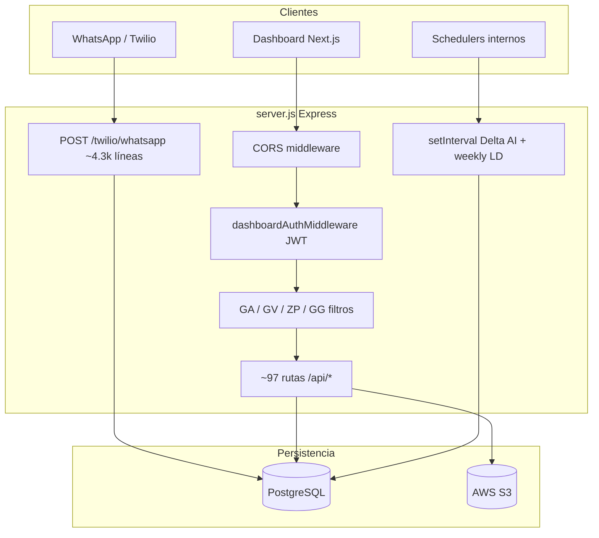

# Auditoría técnica — `server.js`

> **Resumen ejecutivo:** `server.js` es el núcleo monolítico del producto: bot WhatsApp (Twilio), API REST del dashboard, KPIs financieros (IGF, ARR, DICF), generación de PDF/Excel, notificaciones y schedulers. Funciona y está documentado en cabecera, pero concentra demasiada responsabilidad, rutas sin protección en entornos expuestos y deuda de mantenibilidad alta. Prioridad: **seguridad de endpoints públicos** y **modularización progresiva**.

---

## 1. Metadatos

| Campo | Valor |
|-------|--------|
| Archivo | `server.js` |
| Líneas (aprox.) | **17.818** |
| Versión bot (`BOT_VERSION`) | 3.0.0 |
| Stack | Express 4, `pg`, Twilio, AWS S3, XLSX, pdf-lib |
| Entrypoint | `node server.js` (`package.json`) |
| Puerto | `process.env.PORT` (default **10000**) |

### Dependencias internas (módulos `lib/`)

| Módulo | Rol |
|--------|-----|
| `igf-handler.js` | Consultas IGF por WhatsApp |
| `lib/dashboard-auth.js` | JWT dashboard + tokens Excel IGF |
| `lib/arr-load.js`, `arr-refresh-provincia.js`, `forecast-mensual.js`, `dashboard-arr-forecast.js` | ARR / forecast |
| `lib/delta-ingreso-*` | Delta ingreso + AI |
| `lib/dicf.js`, `dicf-acciones.js` | DICF y acciones |
| `lib/weekly-discount-ld-*` | Lectura semanal descuentos |
| `notifications/twilioClient.js` | Envío WhatsApp |

La mayor parte de la lógica de negocio **sigue viviendo dentro de `server.js`**, no en esos módulos.

---

## 2. Arquitectura lógica



### Mapa de secciones (comentarios `/* === */`)

| Sección | Línea aprox. | Contenido |
|---------|--------------|-----------|
| CORS | 56 | Orígenes dashboard |
| ENV & FLAGS | 77 | Pool PG, Twilio, S3 |
| HELPERS | 166 | Teléfonos, TwiML, texto |
| Presupuesto Acapulco / PRE | 281–2209 | Seeds y flujos presupuesto |
| SCHEMA | 2210–2817 | `ensureSchema`, DDL idempotente |
| REPOS / DB | 2818–3096 | Acceso datos folios |
| Presupuesto semanal, proyectos, archivos | 3097–4439 | |
| Notificaciones, S3, ayuda | 4440–4894 | |
| Sesiones WhatsApp | 4895–4949 | `Map` en memoria |
| Rutas HTTP + Dashboard API | 5100–13102 | Kanban, folios, IGF, ARR, DICF |
| Delta Ingreso AI | 13103–13411 | Endpoints test + schedulers |
| Webhook WhatsApp | 13420–17738 | Máquina de estados conversacional |
| START | 17739–17818 | `listen`, `ensureSchema`, jobs |

---

## 3. Superficie HTTP

### 3.1 Conteo

- **~100** declaraciones `app.get|post|patch|delete`
- **~97** rutas bajo `/api/*` con `dashboardAuthMiddleware` (JWT Bearer o `?t=`)
- **Webhook principal:** `POST /twilio/whatsapp` (sin middleware de firma Twilio detectado)

### 3.2 Health y diagnóstico

| Ruta | Auth | Riesgo |
|------|------|--------|
| `GET /health` | No | Bajo |
| `GET /health-db` | No | Medio — expone conectividad DB |
| `GET /health-proyectos` | No | Medio — agregados de `proyectos` |
| `GET /debug/actor` | No (solo si `DEBUG=true`) | **Alto** — resuelve actor por teléfono |

### 3.3 Rutas **sin** `dashboardAuthMiddleware` (crítico en producción)

| Ruta | Método | Impacto |
|------|--------|---------|
| `/api/ai/delta-ingreso/test/help` | GET | Documentación interna pública |
| `/api/ai/delta-ingreso/test/status` | GET | Estado outbox/actions AI |
| `/api/ai/delta-ingreso/test/send-question-now` | POST | **Dispara WhatsApp masivo a GG** |
| `/api/ai/delta-ingreso/test/send-summary-now` | POST | **Dispara resumen a múltiples roles** |
| `/api/igf/como-cambio-excel` | GET | Descarga Excel; protegido por JWT corto (`?t=`) |
| `/twilio/whatsapp` | POST | Entrada total del bot |

> [!warning] Hallazgo crítico
> Los endpoints `/api/ai/delta-ingreso/test/*` no exigen token ni IP allowlist. Cualquiera con la URL pública del servidor puede disparar envíos reales por Twilio.

### 3.4 Dominios funcionales (API autenticada)

| Dominio | Prefijo / ejemplos | Notas |
|---------|-------------------|--------|
| Kanban / KPIs | `/api/dashboard/kanban`, `kpis` | Filtros por rol (`buildDashboardWhere`) |
| Folios | `/api/folios/*` | GV bloqueado vía middleware |
| Action register | `/api/action-register/*` | Export Excel/PDF pesado |
| IGF Forecast | `/api/dashboard/igf-*` | `buildIgfForecastPayload`, PATCH HG |
| ARR / Forecast | `/api/arr/*` | Carga, refresh provincia, Excel |
| Presupuesto / Delta | `presupuesto-comparar`, `delta-venta`, `delta-descuento`, `delta-ingreso` | |
| DICF | `/api/dashboard/dicf-*` | Config, Excel, acciones |
| Adjuntos | action-register, dicf | S3 / streaming |

---

## 4. Autenticación y autorización

### 4.1 Dashboard (JWT)

Implementación en `lib/dashboard-auth.js`:

- Secreto: `DASHBOARD_JWT_SECRET` o `JWT_SECRET`, con fallback por defecto **`folio-dashboard-secret-change-in-production`**
- Expiración token dashboard: **20h**
- Token Excel IGF: **15m**, claim `igfExcel: true`
- Middleware acepta `Authorization: Bearer` **o** query `?t=` (tokens en URL — riesgo de filtración en logs/referrer)

```javascript
// lib/dashboard-auth.js — fallback inseguro si no hay ENV
const JWT_SECRET = process.env.DASHBOARD_JWT_SECRET || process.env.JWT_SECRET || "folio-dashboard-secret-change-in-production";
```

**Log en cada request autenticado:**

```javascript
console.log("[dashboardAuth] auth header presente:", !!req.headers.authorization);
```

Ruido en producción y posible fuga de metadatos de tráfico.

### 4.2 RBAC por rol (en `server.js`)

| Rol | Restricción principal |
|-----|----------------------|
| **GA** | `dashboardBlockGAFinancialKpis` — sin IGF, ARR, DICF financiero |
| **GV** | `dashboardBlockGVForbidden` — solo delta ingreso forecast + DICF planta |
| **GG** | `plantas_permitidas` en JWT |
| **ZP / AD** | Acceso amplio; folios `solo_zp_ad` |
| **CF_CDMX** | Similar a GG con reglas de visibilidad |

La autorización está **repetida** en funciones helper por ruta (`dashboardBlock*`), no centralizada en un router por rol.

### 4.3 WhatsApp

- Identificación por teléfono (`getActorByPhone`) y sesión en memoria
- **No** se encontró `twilio.validateRequest` ni equivalente → cualquier cliente que alcance la URL puede simular webhooks si conoce el formato del body
- Tokens de dashboard se generan desde WhatsApp (`createDashboardToken` ~líneas 5003, 13553, 15066) para enlaces al frontend

---

## 5. Base de datos

### 5.1 Pool PostgreSQL

```javascript
const pool = new Pool({
  connectionString: process.env.DATABASE_URL,
  ssl: process.env.DATABASE_SSL === "false" ? false : { rejectUnauthorized: false },
  max: PG_POOL_MAX || 20,
  connectionTimeoutMillis: 15000,
});
```

| Tema | Evaluación |
|------|------------|
| Parametrización (`$1`, `$2`) | **Buena** en rutas revisadas |
| SSL | `rejectUnauthorized: false` por defecto — común en Render, debilita MITM |
| Conexiones | `pool.connect()` + `release()` en handlers async — patrón correcto siempre que no falte `finally` |
| DDL en arranque | `ensureSchema()` crea schemas/tablas al boot — conveniente pero mezcla migraciones con runtime |

### 5.2 Esquemas tocados desde `server.js`

- `public.*` — folios, plantas, usuarios, presupuesto, proyectos
- `igf.*` — versions, compromiso_lines (lectura + PATCH HG)
- `arr.*` — ventas, forecast, DICF acciones, upload_log

---

## 6. Sesiones y estado en memoria

```javascript
const sessions = new Map(); // clave: teléfono WhatsApp
```

| Problema | Detalle |
|----------|---------|
| Volatilidad | Reinicio del proceso = pérdida de flujos a medias |
| Escalado horizontal | Múltiples instancias no comparten sesión |
| Crecimiento | Sin TTL/evicción visible — riesgo de fuga lenta en `Map` |
| Campos | `estado`, `dd`, presupuesto, IGF, delta, póliza AD, etc. |

---

## 7. Schedulers y procesos en background

| Job | Mecanismo | Cuándo |
|-----|-----------|--------|
| Delta Ingreso AI — pregunta | `setInterval` 60s | Lun/Jue 07:45–07:50 o TEST 17:00 |
| Delta Ingreso AI — resumen | `setInterval` 60s | 07:45 o TEST 17:45 |
| Weekly discount LD | `weeklyDiscountLdScheduler.scheduleWeeklyLDDispatch` | Lunes ~08:15 MX |

- Zona horaria: `America/Mexico_City` vía `Intl.DateTimeFormat`
- Sin cola externa (Redis/Bull) — fallos solo loguean con `.catch`
- En despliegue multi-réplica, **cada instancia** podría disparar el mismo slot si no hay lock distribuido

---

## 8. Integraciones externas

| Servicio | Uso en server.js |
|----------|------------------|
| Twilio | Webhook inbound, `sendWhatsApp` outbound |
| AWS S3 | Cotizaciones, plantilla póliza, adjuntos |
| OpenAI | Vía `lib/delta-ingreso-ai` (no import directo en cabecera) |
| Axios | Descargas media Twilio |

`bodyParser.json({ limit: "8mb" })` — adecuado para uploads base64 en dashboard; vigilar DoS por tamaño.

---

## 9. CORS

```javascript
const corsOrigins = [dashboardOrigin, "http://localhost:3000", "http://127.0.0.1:3000"];
// allow: origin.startsWith(o.replace(/\/$/, ""))
```

- Lista cerrada + `startsWith` — flexible pero puede permitir subdominios no previstos si el origen configurado es corto
- No hay `Access-Control-Allow-Credentials` explícito (cookies no parecen usarse; JWT en header/query)

---

## 10. Calidad de código y mantenibilidad

### Fortalezas

1. **Comentarios de sección** claros y convención de estados (`ESTADOS`, `ETAPA_VISUAL`)
2. **Extracción parcial** a `lib/` para ARR, DICF, auth, IGF WhatsApp
3. **Validación de query** en endpoints financieros (year/month, `upload_day` YYYY-MM-DD)
4. **Feature flags** (`FLAGS`) y `BOT_VERSION` para operación
5. **RBAC** explícito para GA/GV en KPIs sensibles
6. **Chunking** de mensajes WhatsApp (`chunkWhatsAppText`, límite 1550/1400)

### Debilidades

| # | Hallazgo | Severidad |
|---|----------|-----------|
| 1 | Monolito ~18k líneas — difícil review, test y onboarding | Alta |
| 2 | Webhook WhatsApp ~4.300 líneas en un solo handler | Alta |
| 3 | **Cero tests** automatizados referenciando `server.js` | Alta |
| 4 | Endpoints AI test sin autenticación | **Crítica** |
| 5 | Sin validación firma Twilio | **Crítica** |
| 6 | JWT secret por defecto débil | **Crítica** si no hay ENV en prod |
| 7 | `health-db` / `health-proyectos` públicos | Media |
| 8 | Log `[dashboardAuth]` en cada request | Baja |
| 9 | Duplicación: `buildIgfForecastPayload`, `recalcularUtilYResultado`, filtros planta | Media |
| 10 | `ensureSchema` mezcla migración + app | Media |
| 11 | Tokens dashboard en query string `?t=` | Media |
| 12 | Sin rate limiting / helmet / request ID | Media |

### Complejidad ciclomática estimada

- `POST /twilio/whatsapp`: **muy alta** (cientos de ramas por comando y estado)
- `buildIgfForecastPayload`: **alta** (join IGF + ARR + folios + presupuesto)
- Export action-register PDF: **alta** (líneas 6895–7640 aprox.)

---

## 11. Seguridad — checklist

| Control | Estado |
|---------|--------|
| HTTPS terminado en Render/load balancer | Asumido ✓ |
| Auth en API dashboard | JWT ✓ (con reservas `?t=`) |
| Auth webhook Twilio | ✗ No implementada |
| Secret management | Parcial — fallbacks peligrosos |
| Principle of least privilege DB | No evaluado (una sola `DATABASE_URL`) |
| Rate limiting | ✗ |
| Input sanitization SQL | Parametrizado ✓ |
| Exposición PII en logs DEBUG | Riesgo si `DEBUG=true` en prod |
| Endpoints administrativos AI | ✗ Abiertos |

---

## 12. Rendimiento y operación

| Área | Observación |
|------|-------------|
| IGF Forecast GET | Varias queries por planta (folios, presupuesto); candidato a cache por `version_id` + periodo |
| Kanban / KPIs | Queries con `buildDashboardWhere` — índices en `folios(estatus, planta_id, mes_cargo)` recomendados |
| Excel/PDF grandes | Rutas síncronas en event loop — pueden bloquear bajo carga |
| Pool max 20 | Ajustar según instancias Render y límites Postgres |
| Arranque | `ensureSchema` antes de schedulers — fallo no hace `exit(1)` (servidor escucha igual) |

---

## 13. Observabilidad

- Logging: `console.log` / `console.warn` / `console.error` dispersos
- Sin correlación request-id
- Errores API: típicamente `{ error: e.message }` — puede filtrar detalles internos
- Eventos Twilio outbound etiquetados (`event: "delta_ingreso_ai_question"`, etc.) en módulo notificaciones

---

## 14. Recomendaciones priorizadas

### P0 — Inmediato (seguridad)

1. **Proteger** `/api/ai/delta-ingreso/test/*` con API key, IP allowlist o deshabilitar fuera de `NODE_ENV=development`
2. **Configurar** `DASHBOARD_JWT_SECRET` fuerte en producción; eliminar fallback por defecto en deploy
3. **Implementar** validación `X-Twilio-Signature` en `POST /twilio/whatsapp`
4. **Restringir** `health-db`, `health-proyectos` y `debug/actor` (red interna o auth)

### P1 — Corto plazo (estabilidad)

5. Extraer **router Express** por dominio: `routes/folios.js`, `routes/igf.js`, `routes/whatsapp.js`
6. Mover máquina de estados WhatsApp a `whatsapp-router.js` o máquina explícita por `estado`
7. Persistir sesiones en **Redis** o tabla `wa_sessions` si hay >1 réplica
8. Lock distribuido para schedulers (advisory lock PG o Redis)

### P2 — Medio plazo (calidad)

9. Suite de tests: `buildDashboardWhere`, `recalcularUtilYResultado`, `parseDashboardFilters`, auth middleware
10. Migraciones SQL versionadas (reemplazar DDL en `ensureSchema` progresivamente)
11. Quitar log `[dashboardAuth]` en producción; usar logger estructurado
12. Documentar variables ENV en `.env.example` (`DASHBOARD_JWT_SECRET`, `DASHBOARD_URL`, `PG_POOL_MAX`)

### P3 — Largo plazo (arquitectura)

13. Separar **worker** (schedulers + WhatsApp pesado) de **API** (solo REST)
14. OpenAPI / contrato para frontend-dashboard
15. Métricas (latencia por ruta, pool wait, errores Twilio)

---

## 15. Referencias en el repositorio

- Auth: [[lib/dashboard-auth.js]]
- IGF WhatsApp: [[igf-handler.js]]
- Auditoría fila Impacto IGF: [[AUDITORIA_IMPACTO_IMPORTE.md]]
- ARR diseño: [[ARR_FORECAST_DESIGN.md]]
- Variables entorno: [[../.env.example]]

---

## 16. Conclusión

`server.js` es un **monolito operativo maduro** que integra correctamente folios, finanzas y WhatsApp en un solo proceso, con buenas prácticas locales (SQL parametrizado, RBAC por rol, validación de periodos). El coste es **escalabilidad limitada**, **riesgo de seguridad en endpoints expuestos** y **mantenimiento costoso**.

La auditoría no recomienda reescritura total; sí un plan incremental: cerrar superficie pública, validar Twilio, modularizar por routers y extraer el webhook a su propio módulo antes de añadir más features en el mismo archivo.

---

*Generado para Obsidian — proyecto folio-whatsapp-bot.*
